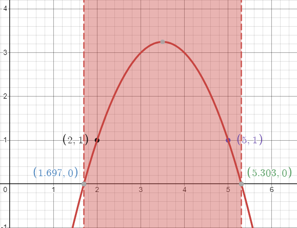

# [](https://adventofcode.com/2023/)

# [Day 1](https://adventofcode.com/2023/day/1)

### Day 1 Part 1 
#### Input:
```
1abc2
pqr3stu8vwx
a1b2c3d4e5f
treb7uchet
```
#### Output:
```
12
38
15
77
```
Final answer: **142** (sum total of each line output)

#### Solution:
```
Parse each character on each line and check if it's a digit
Return once you find the first digit,
Start from the end or reverse the string
Return once you find the first digit(last digit)
```
### Day 1 Part 2
#### Input:
```
two1nine
eightwothree
abcone2threexyz
xtwone3four
4nineeightseven2
zoneight234
7pqrstsixteen

```
#### Output:
```
29
93
13
24
42
14
76
```
Final answer: **281** (sum total of each line output)

#### Solution:

```
In each line, find strings: "one", "two", .... 'nine",
Replace each found string as '1', '2', '3', ... '9'
Run solution for Part 1
```

# [Day 2](https://adventofcode.com/2023/day/2)

The Elf would first like to know which games would have been possible if the bag contained only **12** red cubes, **13** green cubes, and **14** blue cubes?

#### Input:

```
Game 1: 3 blue, 4 red; 1 red, 2 green, 6 blue; 2 green
Game 2: 1 blue, 2 green; 3 green, 4 blue, 1 red; 1 green, 1 blue
Game 3: 8 green, 6 blue, 20 red; 5 blue, 4 red, 13 green; 5 green, 1 red
Game 4: 1 green, 3 red, 6 blue; 3 green, 6 red; 3 green, 15 blue, 14 red
Game 5: 6 red, 1 blue, 3 green; 2 blue, 1 red, 2 green
```

#### Output:

```
Game 1: possible
Game 2: possible
Game 3: NOT possible
Game 4: NOT possible
Game 5: possible
```
Final answer: **8** (sum of game IDs that were possible (1+2+5=8))


#### Solution:

```
MAX_RED_NUMBER = 12
MAX_GREEN_NUMBER = 13
MAX_BLUE_NUMBER = 14

For each line
    store game_id
    Split: string by "n color",
        For each color:
            Check color:
                if max_color_number < current_number:
                    game_is_not_possible_ = true
            if game_is_not_possible:
                return
            else:
                game_id_sum += game_id
```

### Day 2 Part 2

As you continue your walk, the Elf poses a second question: in each game you played, what is the fewest number of cubes of each color that could have been in the bag to make the game possible?

#### Input:

```
Game 1: 3 blue, 4 red; 1 red, 2 green, 6 blue; 2 green
Game 2: 1 blue, 2 green; 3 green, 4 blue, 1 red; 1 green, 1 blue
Game 3: 8 green, 6 blue, 20 red; 5 blue, 4 red, 13 green; 5 green, 1 red
Game 4: 1 green, 3 red, 6 blue; 3 green, 6 red; 3 green, 15 blue, 14 red
Game 5: 6 red, 1 blue, 3 green; 2 blue, 1 red, 2 green
```
#### Output:

```
Game 1: 4*2*6 = 48
Game 2: 1*3*4 = 12
Game 3: 20*13*6 = 1560
Game 4: 14*3*2 = 630
Game 5: 6*3*2 = 36
```
Final answer: **2286** (Sum of the powers of each min color in each line(48+12+1560+630+36))

#### Solution:
```
For each line
    store game_id
    Split: string by "n color",
        For each color:
            Check color:
                if red:
                    if min_red < current_number:
                        min_red = current_number
                elif green:
                    if min_green < current_number:
                        min_green = current_number
                // blue
                else:
                    if min_blue < current_number:
                        min_blue = current_number
                if max_color_number < current_number:
                    game_is_not_possible_ = true
            if game_is_not_possible:
                return
            else:
                game_id_sum += game_id

```
# [Day 3](https://adventofcode.com/2023/day/3)

The engineer explains that an engine part seems to be missing from the engine, but nobody can figure out which one. If you can **add up all the part numbers** in the engine schematic, it should be easy to work out which part is missing.

The engine schematic (your puzzle input) consists of a visual representation of the engine. There are lots of numbers and symbols you don't really understand, but apparently **any number adjacent to a symbol**, even diagonally, is a "part number" and should be included in your sum. (Periods (.) do not count as a symbol.)

Input:
```
467..114..
...*......
..35..633.
......#...
617*......
.....+.58.
..592.....
......755.
...$.*....
.664.598..
```

Output:

```
467, 35, 633, 617, 592, 755, 664, 598
```

Final answer: **4361** (Sum of the part numbers 467+35+633...+598)

#### Solution:

Two rare cases: 
    First line doesnt have a line above it
    Last line does not have a line below it
Another two cases where the number is directly on the edge, in which the slot directly left or right does not exist.
There are also cases where these two are combined.


```
Case 1 (First Line):
-----------------------
467. or .114.  or ..114
...*    .....     .....
-----------------------

Regular Case:
-----------------------
..*.    .....    .....    ....
.35. or .633. or 633.. or .633
....    .#...    #....    #...
-----------------------
Case 2 (Last Line):
-----------------------
...$.    .*...     ..*..
.664. or .598. or  ..598
------------------------
```

```
Handle first and last case.
Handling base case:
    For each line, find symbol:
        if symbol, check the 9 adjacent spots:
            If number found, find the whole number,
            Add to sum
            
```


# [Day 4](https://adventofcode.com/2023/day/4)

The Elf leads you over to the pile of colorful cards. There, you discover dozens of scratchcards, all with their opaque covering already scratched off. Picking one up, it looks like each card has two lists of numbers separated by a vertical bar (|): a list of **winning numbers** and then a list of **numbers you have**. You organize the information into a table (your puzzle input).

As far as the Elf has been able to figure out, you have to figure out which of the **numbers you have** appear in the list of **winning numbers**. The first match makes the card worth **one point** and each match after the first **doubles** the point value of that card.

#### Input:

```
Card 1: 41 48 83 86 17 | 83 86  6 31 17  9 48 53
Card 2: 13 32 20 16 61 | 61 30 68 82 17 32 24 19
Card 3:  1 21 53 59 44 | 69 82 63 72 16 21 14  1
Card 4: 41 92 73 84 69 | 59 84 76 51 58  5 54 83
Card 5: 87 83 26 28 32 | 88 30 70 12 93 22 82 36
Card 6: 31 18 13 56 72 | 74 77 10 23 35 67 36 11
```
#### Output:
```
Card 1: 41, 48, 83, 86 -> 2^(4-1) = 8
Card 2: 32, 61 -> 2^(2-1) = 2
Card 3: 1, 21 -> 2^(2-1) = 2
Card 4: 84 -> 2^0 = 1
Card 5: 0
Card 6: 0
```
Final answer: **13** (Sum total of points)

#### Solution: 
```
Split each line into winning_numbers and owned_numbers
for x in winning_numbers:
            for y in owned_numbers:
                if(x == y):
                    points += 1
    sum_of_points += 2^(points - 1)
```

## Day 4 Part 2

There's no such thing as "points". Instead, scratchcards only cause you to win more scratchcards equal to the number of winning numbers you have.

Specifically, you win copies of the scratchcards below the winning card equal to the number of matches. So, if card 10 were to have 5 matching numbers, you would win one copy each of cards 11, 12, 13, 14, and 15.

Copies of scratchcards are scored like normal scratchcards and have the same card number as the card they copied. So, if you win a copy of card 10 and it has 5 matching numbers, it would then win a copy of the same cards that the original card 10 won: cards 11, 12, 13, 14, and 15. This process repeats until none of the copies cause you to win any more cards. (Cards will never make you copy a card past the end of the table.)

```
Assuming you have:
    the list of points for each card: points_list
        where points_list[i] = total points on the ith card
    
Create a list where each card represent a copy of each card, the_duplicates = [0, 1, 1, ..., 1]
```
```py
for i, elem in enumerate(the_duplicates):

        while the_duplicates[i] != 0:

            # Subtract 1 Card from list of duplicates
            the_duplicates[i] -= 1
            # Add 1 Card to total number of cards
            card_count += 1

            print("Card {}, points: {}".format(i, points_list[i]))
            points = points_list[i]

            for x in range(1, points+1):
               
                print("extra card: ", i+x)
                # Checks if the extra card is not past the end of the table
                # (Cards will never make you copy a card past the end of the table.)
                if not (i+x > len(points_list)-1):
                    the_duplicates[i+x] += 1
```

# [Day 5](https://adventofcode.com/2023/day/5) 

## Part 1

### Input:

```
seeds: 79 14 55 13

seed-to-soil map:
50 98 2
52 50 48

soil-to-fertilizer map:
0 15 37
37 52 2
39 0 15

fertilizer-to-water map:
49 53 8
0 11 42
42 0 7
57 7 4

water-to-light map:
88 18 7
18 25 70

light-to-temperature map:
45 77 23
81 45 19
68 64 13

temperature-to-humidity map:
0 69 1
1 0 69

humidity-to-location map:
60 56 37
56 93 4
```

### Output


Seed 79, soil 81, fertilizer 81, water 81, light 74, temperature 78, humidity 78, location **82**.

Seed 14, soil 14, fertilizer 53, water 49, light 42, temperature 42, humidity 43, location **43**.

Seed 55, soil 57, fertilizer 57, water 53, light 46, temperature 82, humidity 82, location **86**.

Seed 13, soil 13, fertilizer 52, water 41, light 34, temperature 34, humidity 35, location **35**.

Final answer: **35** (minimum location number)

### Solution
Simple solution: go through each map with the starting seed to get the location.

MapN(Map3(Map2(Map1(seed))))

#### Map Handling
```
Given a map (destination, source, range):
50 98 2
52 50 48

Map can be stored as
map: [[50, 98, 2], [52, 50, 48]]

def Map(key) -> value:
    for elem in map:
        if elem[1] + elem[2] - 1 >= key >=  elem[1]:
            return  key - elem[1] + elem[0]

```


## Part 2

- [ ] Find THE Map which Maps seed to location, (Merge maps)
- [x] Reduce Seeds instead of manually inputting each seed invidually

### Problem

Everyone will starve if you only plant such a small number of seeds. Re-reading the almanac, it looks like the seeds: line actually describes ranges of seed numbers.

The values on the initial seeds: line come in pairs. Within each pair, the first value is the start of the range and the second value is the length of the range. So, in the first line of the example above:

seeds: 79 14 55 13

This line describes two ranges of seed numbers to be planted in the garden. The first range starts with seed number 79 and contains 14 values: 79, 80, ..., 91, 92. The second range starts with seed number 55 and contains 13 values: 55, 56, ..., 66, 67

### Example

```
seeds 79 14 55 13
Map: 
56 75 10
77 85 26

Map maps out numbers: 
75 ~ 84 to 56 ~ 65
85 ~ 110 to 77 ~ 102

Seed [79, 14] means seeds 79 ~ 92
This set of seeds must be split according to the map
Our map describes 79 ~ 84 mapping to 60 ~ 65
85 ~ 92 remains which maps to 77 ~ 84
Seed [55, 13] means seeds 55 ~ 67
            which maps to 55 ~ 67 as it's out of range
```

### Solution
Checking individual seeds will take too long.

What we can do is use the ranges.
```
Let 
keyPairList = [[79, 14], [55, 13]]
Where each element of keyPairList actually means a list of keys [79, 80, 81, ..., 93]
Let keyStart be the starting element of each inner list and range the last element.
Then the list of keys is equal to: [keyStart, keyStart + 1, keyStart +2, ..., keyStart + range - 1]

Let Map: destination, source, range
56 75 10
77 85 26
Storing map as map: [[56, 75, 10], [77, 85, 26]]

Each inner list describes a range of numbers mapping out

element[0] = destination
element[1] = source
element[2] = range

function find():
    let
    sourceStart = source
    sourceRange = range
    sourceEnd = source +  sourceRange - 1

    Find pair [keyStart, keyRange] where sourceEnd >= keyStart >= sourceStart
    keyEnd = keyStart + keyRange - 1

    if sourceEnd >= keyEnd:
        return [keyStart, keyRange]
    else 
        remainderRange = keyEnd - sourceEnd
        remainder = [sourceEnd + 1, remainderRange]
        return [seedStart, source end] + find(remainder)
    
    return [[keyStart, keyEnd]]

```
#### Running this through using the example above:
```
keyPairList:[[79, 14], [55, 13]]
Map:
56 75 10
77 85 26

sourceStart = 75
sourceRange = 10
sourceEnd = 84 (75 + 10 - 1)

pair [keyStart, keyRange] = [79, 14]
keyEnd = keyStart + keyRange - 1 = 92 (79 + 14 - 1)
and the corresponding map is 
[56, 75, 10] as sourceEnd: 84 (75 + 10 - 1) >= keyStart: 79

if sourceEnd: 84 >= keyEnd: 92 -> false
else -> this is ran
    remainder = [85, 7]
    return [79, 5] + find(remainder)

remainder = [85, 7]

find([85, 7]):
    pair [keyStart, range] = [85, 7]
    keyEnd = 91
and the corresponding map is 
[77, 85, 26] as sourceEnd: (85+26-1) >= keyStart: 85

if sourceEnd: 110 >= keyEnd: 91 -> true
    return [85, 7]

Final run through should be: [[79, 5], [85, 7]]

We can then use the get key function

map: [[50, 98, 2], [52, 50, 48]]

def Map.get(key) -> value:
    for elem in map:
        if elem[1] + elem[2] - 1 >= key >=  elem[1]:
            return  key - elem[1] + elem[0]

Assuming input = [keyStart, keyRange] = [79, 5]

startValue = Map.get(keyStart) 
60 = Map.get(79) 

endValue = startValue + keyRange
64 = 60 + 5 - 1

```
Therefore keys 79 ~ 84 maps to 60 ~ 65 and 85 ~ 91 map to 85 ~ 91

#### Problem Solving:
```
1st - Get seeds:
    Seeds are in seed_range_pairs = [[79, 14], [55, 13]]
        Example: [79, 14] denotes seeds 79 ~ 92 or elem[0] ~ (elem[0] + elem[1] - 1)

2nd - For each seed pair - 
    Split them in such a way that the map works on them

3rd - 

```

# [Day 6](https://adventofcode.com/2023/day/6)

Given a race's time and distance
Where the time is the race's time in milliseconds
distance is the record distance in millimeters

Holding a button increases the rate of speed your boat goes. The goal is to beat the record time.

## Solution
```
Example:
    time = 7
    distance = 9

record_time = 7
record_distance = 9

Let Hold equal the milliseconds the button is pressed

If Hold(1):
    Boat goes 1 mm/s -> (7-1)*(1mm/s) = 6 millimeters
If Hold(2):
    Boat goes 2 mm/s -> (7-2)(2mm/s) = 10 millimeters

Therefore the distance the boat travels, boat_distance:
    boat_distance = (record_time - hold_time)*(boat_speed) 
    boat_speed = hold_time
    boat_distance = record_time*hold_time - hold_time^2

boat_distance must be greater than record_distance

time*hold_time - hold_time^2 > record_distance
hold_time(record_time - hold_time) - record_distance > 0
-hold_time^2 + record_time*hold_time - record_distance > 0

```
Quadratic equation:
$$
-\text{hold\_time}^2 + \text{record\_time}\times\text{hold\_time} - \text{record\_distance} > 0
$$

Using the quadratic formula where:
$$a = -1$$
$$b = \text{record\_time}$$
$$c = -\text{record\_distance}$$

$$
\begin{align*}
\\x&=\frac{-b\pm\sqrt[]{b^2-4ac}}{2a}
\end{align*}
$$

```py
root_0 = ((-1*b)+math.sqrt(math.pow(b, 2) - 4*a*c ))/(2*a)
root_1 = ((-1*b)- math.sqrt(math.pow(b, 2) - 4*a*c ))/(2*a)
```

Once we get the roots, they will not be integers so we must convert them.
The smallest root must be floored then added by 1 while the largest root must be ceiled then subtracted by 1. This ensures that they're in the range of the equation

```py
floor_root_0 = math.floor(root_0) + 1
ceil_root_1 = math.ceil(root_1) - 1
```



Finally to check the number of ways to win, we simply subtract the largest root from the smallest and add 1 

```py
ways_to_win = hold_time[1] - hold_time[0] + 1
```
### Example Output
```
times:  ['7', '15', '30']
distances:  ['9', '40', '200']

record_time: 7
record_distance: 9
h^2 + 7*h - 9
a:-1, b:7, c:-9
1.6972243622680054 5.302775637731995
2 5
ways_to_win:  4

record_time: 15
record_distance: 40
h^2 + 15*h - 40
a:-1, b:15, c:-40
3.4688711258507254 11.531128874149275
4 11
ways_to_win:  8

record_time: 30
record_distance: 200
h^2 + 30*h - 200
a:-1, b:30, c:-200
10.0 20.0
11 19
ways_to_win:  9
ways_to_win_list:  [4, 8, 9]
ways_to_win_list product: 288
```


# [Day 7](https://adventofcode.com/2023/day/7)

## Problem Solving/Pseudo code

## Putting the hands in order of strength

There are 7 types of cards from strongest to weakest:
- Five of a kind
- Four of a kind
- Full house
- Three of a kind
- Two pair
- One pair
- High card

### Types of Cards


| Type | Definition |
| ---- | ---- |
| Five of a kind | Where all five cards have the same label |  
| Four of a kind| Where four cards have the same label and one card has a different label |  
| Full house | Where three cards have the same label, and the remaining two cards share a different label. |
| Three of a kind | Where three cards have the same label, and the remaining two cards are each different from any other card in the hand |
| Two pair | Where two cards share one label, two other cards share a second label, and the remaining card has a third label |
| One pair | Where two cards share one label, and the other three cards have a different label from the pair and each other
| High card | Where all cards' labels are distinct


### Problem Solving

Given 5 cards, we have to check each invidual card
```
Example hand: 32T3K

Compare:
    3 and 2 -> dif
    3 and T -> dif
    3 and 3 -> same
    3 and K -> dif
        2 and T -> dif
        2 and 3 -> dif
        2 and K -> dif
            T and 3 -> dif
            T and K -> dif
                3 and K -> dif
    Hand is One pair
```

We then have a pattern:
```
Let n be the number of cards and i be the ith card:
Check
i and i + 2, i and i + 3, ..., i and i + 5
i + 2 and i +3, ..., i + 2 and i + 5
```
$$ 
\text{We check a total of } \frac{n^2 + n}{2} \text{ times} 
$$ 

We first find the pairs in the hand:

```py
def find_pair(the_hand: str):
    if the_hand == "":
        return []
    pairs = []
    card0 = the_hand[0]
    for card in the_hand[1:]:
        if(card == card0):
            pairs.append(card + card)
        
    return pairs + find_pair(the_hand[1:])

```
`find_pair()` will reuse the same card for pair so if there are 5 cards of the kind, it will produce 10 "pairs.

| Same cards |"Pairs" | Type |
| ----| ---- | ---- |
| 1 | 0 | High Card |
| 2 | 1 | One pair  |
| 1 and 1| 2 | Two pair
| 3 | 3 | Three of a kind |
| 3 and 2| 4 | Full House
| 4 | 6 | Four of a kind
| 5 | 10 | Five of a kind

Two pair and Full house are the only different types. 

A two pair will have 2 sets of identical cards to one another but separate from each set.
Example: `22334`. Therefore a Two Pair will give us 2 "Pairs"

A full house hand will have 3 of the same cards and 2 that are the same with each other but different from the other 3. Example: `23332`. Therefore a Full House will give us 4 "Pairs".


```
Let pairs be the list given from find_pair()

switch len(pairs):
    case 0: High card
    case 1: One Pair
    case 2: Two Pair
    case 3: Three of a kind
    case 4: Full house
    case 6: Four of a kind
    case 10: Five of a kind
```

We now know the type of card each hand is. We simply now need to order them.
From strongest to weakest the cards are A, K, Q, J, T, 9, 8, 7, 6, 5, 4, 3, 2,
Assuming the hands are grouped by their **type**, i.e. All high cards are in an unordered list:

Comparing one high_card to another we have to take its first character, and compare them. If they're equal, we move to the next card in the hand. 

We first have to assign values to the different cards. To do this I use a map where:
```
'2' = 0, 
'3' = 1, 
'4' = 2 
all the way to 'A' = 12
```

```
compare(hand_0, hand_1):
    for (int i = 0; i < 5; i++) {

        if (map(hand_0[i]) - map(hand_1[i])) != 0:

            return map(hand_0[i]) - map(hand_1[i])
        
    } 
```
After sorting each list, we know create a new list where we add each element of each list starting from the weakest to the strongest hand.
`high_cards | one pair | ... | five_of_a_kind |`

Now we iterate through them:

```
Let ranked_list be the list of tuples where a tuple is (hand, bid)
and total_winnings a sum of each bid*rank

for i, hand in enumerate(ranked_list):

    total_winnings = total_winnings + hand[1]*(i+1)

```

## Day 7 Part 2
 
